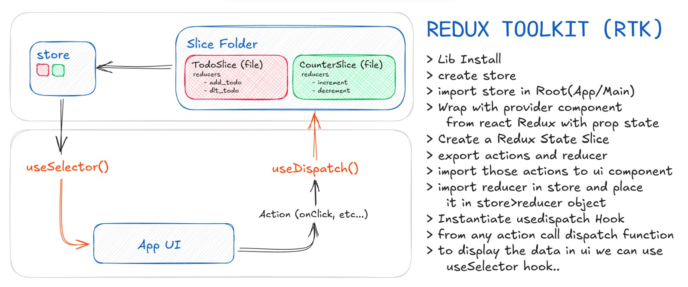
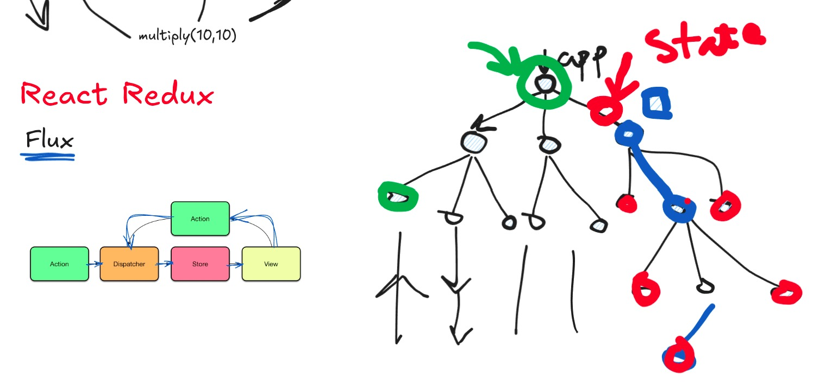

### REDUX TOOLKIT (RTK)

#### RTK Query

RTK Query converts the endpoint names to CamelCase when generating hooks

- If the endpoint name is in camelCase (e.g., getCategories, getUserById), the hook will start with use and end with Query (for queries) or Mutation (for mutations). The transformation retains the camelCase structure.

- If the endpoint is not in camelCase (e.g., snake_case or kebab-case): It will be automatically converted to camelCase in the hook.
